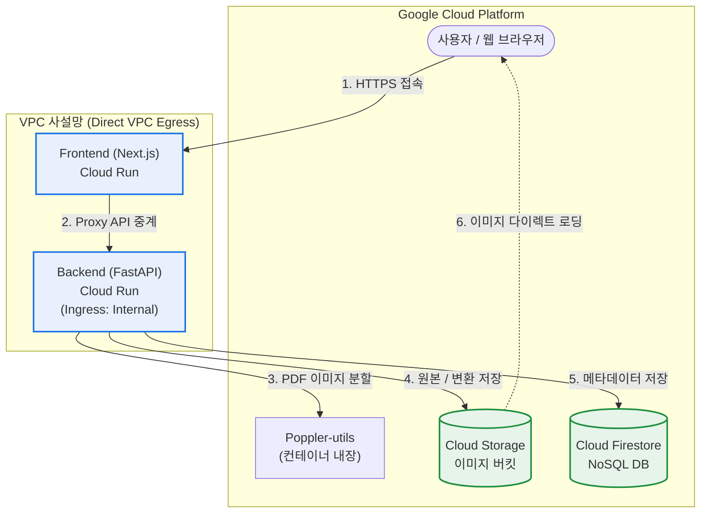

[🇺🇸 English Version](./README_EN.md)

# 📖 JJFlipBook - PDF 플립북 뷰어 서비스

PDF 문서를 업로드하여 웹 브라우저에서 실제 책을 넘기는 듯한 **3D 플립북(Page Flip)** 형태로 감상할 수 있는 어플리케이션입니다.

---

## 🏗️ 전체 아키텍처

본 프로젝트는 **Next.js 프론트엔드**와 **FastAPI 백엔드**, 그리고 **Google Cloud 인프라**를 전격 활용하여 탄생한 서버리스 기반 멀티 티어 애플리케이션입니다.

| 계층 (Layer) | 기술 스택 / 활용 |
| :--- | :--- |
| **Frontend** | `Next.js 14+`, `TailwindCSS / Vanilla CSS`, `react-pageflip` (3D 넘김) |
| **Backend** | `FastAPI (Python 3.11)`, `poppler-utils`, `pdf2image` (PDF 분할 변환) |
| **Database** | `Google Cloud Firestore` (NoSQL - 오버레이 및 메타 영구 보존) |
| **Storage** | `Google Cloud Storage` (변환된 대형 페이지 이미지 저장소 - 날짜별 폴더 구조화) |
| **Compute** | `Google Cloud Run` (서버리스 컨테이너 수직 탑재 배포) |

---

## 🏃 로컬 구동 방법

로컬 및 오프라인 환경에서 테스트 시 아래 가이드를 상호 참조하여 실행합니다.

### 1. Backend (FastAPI) 기동
```bash
# 1. 백엔드 폴더 이동 및 가상환경 설정
cd backend
python3 -m venv venv
source venv/bin/activate

# 2. 의존성 패키지 설치
pip install -r requirements.txt

# 3. 로컬 가동 (기본 8000 포트)
uvicorn main:app --reload --host 0.0.0.0 --port 8000
```
> [!NOTE]  
> 로컬에서 GCS 및 Firestore 연동을 위해서는 사용자 터미널에 `gcloud auth application-default login` 인증 토큰이 필수적입니다.

### 2. Frontend (Next.js) 기동
```bash
# 1. 프론트엔드 폴더 이동 및 패키지 설치
cd frontend
npm install

# 2. 로컬 가동 (기본 3000 포트)
npm run dev
```

---

## 🚀 Google Cloud Run 원클릭 배포 가이드

본 지면에 포함된 쉘 도구(`deploy.sh`)를 가동하면, Artifact Registry 빌드 및 Cloud Run 자동 교차 주입 배포를 5분 내로 원클릭 가동할 수 있습니다.

```bash
# 워크스페이스 마스터 디렉토리에서 실행
./deploy.sh
```

### 💡 주요 환경 변수 개요 (`deploy.sh` 가 자동 주입)
*   `NEXT_PUBLIC_BACKEND_URL`: 프론트엔드가 static 빌드 시 백엔드 앤드포인트를 바라볼 수 있도록 정적으로 구워지는 주소입니다.
*   `GOOGLE_CLOUD_PROJECT`: Cloud Storage 및 Firestore SDK 호출 시 낚아채는 프로젝트 ID 변수입니다.

> [!IMPORTANT]
> **Cloud Run 메모리 및 CPU 권장 사항**: PDF 페이지 장 수가 많거나 해상도가 높을 경우 연산 RAM 소모량이 큽니다. 백앤드의 원활한 안정적 연산을 위해 `deploy.sh` 내에 `--memory=2Gi` 및 `--no-cpu-throttling` 확충 레벨이 배정되어 있습니다. 

---

## 📂 디렉토리 구조도

```text
├── backend/
│   ├── main.py            # FastAPI 비즈니스 로직 (Firestore, GCS 연동)
│   ├── models.py          # Pydantic NoSQL 데이터 모델 팩토리
│   ├── pdf_utils.py       # poppler 기반 PDF 페이지 렌더링 디코더
│   ├── Dockerfile         # 백엔드 컨테이너 빌드 가이드 
│   └── requirements.txt   # 라이브러리 명세 파이프라인
│
├── frontend/
│   ├── src/app/           # Next.js App Router (Dashboard 및 View 페이지)
│   ├── Dockerfile         # 독립형 standalone Next.js 최적화 빌드 펙
│   └── cloudbuild.yaml    # 빌드 시점 ARG 환경변수 주입 스펙
│
└── deploy.sh              # Cloud Run 원클릭 배포 자동화 마스터 스크립트
```

## 🚀 대용량 PDF 처리 및 성능/안정성 최적화 (OOM 방지)

대용량 문서 업로드 및 변환 시 서버 과부하 및 메모리 고갈(OOM)을 방지하도록 백엔드와 프론트엔드의 파일 처리 파이프라인을 스트리밍 및 분할 구조로 최신화했습니다.

### 1. 청크 단위 PDF 변환 (Chunked PDF Processing)
*   **메모리 스파이크 차단**: 대형 PDF 전체를 메모리에 로드하지 않고, **5페이지 단위 청크(Chunk)**로 순차 디코딩하여 RAM 점유율을 극도로 낮추었습니다. (`pdf_utils.py`)
*   **렌더링 멀티 프로세스**: `pdf2image` 디코딩 연산자에 `thread_count=4` 분산 레벨을 부여하여 무거운 변환 코스트를 분할 가속합니다.

### 2. 엔드-투-엔드 스트리밍 업로드 (Streaming Pipeline)
*   **Frontend-Proxy Relay**: Next.js API Routes 에서 페이로드를 전체 버퍼링하지 않고 `Request.body`를 그대로 파이프하는 **Streaming Body Proxy (`duplex: 'half'`)**를 가동하여 대형 파일 중계 부하를 제거했습니다.
*   **Backend Streaming Sink**: FastAPI에서 `await file.read()` 대신 `shutil.copyfileobj` 스트리밍을 통해 로컬 임시 디렉토리에 고부담 바인딩 없이 파이프합니다. (`main.py`)
*   **스레딩 GCS 동시 업로드**: I/O 바운드 구간을 `ThreadPoolExecutor` 풀 구조로 우회하여 5개의 연동 페이로드가 **동시 다발적 릴레이 전송**을 수행합니다.

### 3. 📂 1-Level 폴더 시스템 및 연쇄 관리 (Cascade Delete)
*   **논리적 트리 결합**: Firestore 메타데이터(`folder_id`) 기반의 1단계 폴더 파티션을 지원하여 업로드된 문서를 관리할 수 있습니다.
*   **물리 분리 아키텍처 보존**: GCS에 저장되는 실제 객체(이미지 Blob)들은 폴더 트리 종속성 없이 개별 UID 생명주기로 관리되어, **빠른 데이터 이동 및 확장성**을 철저히 보장합니다.
*   **연쇄 파기(Cascade Cleanup)**: 대상 폴더 삭제 시 내부에 맵핑된 메인 데이터(Firestore), 오버레이 종속 데이터, GCS 실물 파편 스토리지까지 고아(Orphan) 잔재 없이 완벽히 클린업합니다.

### 4. 확실한 자원 회수 (Resource Cleanup Guarantee)
*   **에러 내성 강화**: 파일 처리 성공 여부와 무관하게 `finally` 블록에서 디렉토리 소거(`shutil.rmtree`)를 강제 마킹하여 임시 스토리지 누수가 원천 차단됩니다.

### 5. 스마트 미디어 & 원본 에셋 보존 (Original PDF & Audio)
*   **원본 PDF 영구 보존**: PDF 업로드 시 이미지로 쪼개질 뿐만 아니라, 뷰어 사용자가 언제든 원본을 다운로드할 수 있도록 원본 `.pdf` 파일 역시 GCS 버킷에 동시 업로드되어 영구 보존됩니다.
*   **직관적인 다운로드 UI**: 플립북 뷰어 하단 컨트롤 바에 'PDF 다운로드 아이콘'이 독립적으로 렌더링되며, 클릭 시 GCS 원본 링크를 통해 원본 파일이 다이렉트로 다운로드됩니다.
*   **배경음악 우회 락해제 (Autoplay Bypass)**: 모바일(iOS Safari 등)의 엄격한 '자동 재생 차단 정책(Autoplay Policy)'을 완벽히 우회하기 위해, 뷰어 화면 어디든 첫 터치(`pointerdown`, `touchstart`)가 발생하는 즉시 백그라운드 `.mp3` 오디오의 재생 락을 해제(Unlock)하는 이벤트 리스너를 연동했습니다.

---

## 📊 대시보드 사용성 및 정렬 고도화

사용자 경험과 직관적인 문맥 전달력을 위한 데이터 렌더링 리비전입니다.

*   **최신순 자동 정렬**: 생성일(`created_at`) 타임스탬프를 기준으로 내림차순 렌더 큐를 고정하여 신규 투입된 문서가 상단에 직관 배치됩니다.
*   **업데이트 날짜 시각화**: 카드 피처 뷰 왼쪽 하단에 통일된 연월일 데이트 레이블을 자동 투사하여 문서 히스토리를 강화했습니다.
*   **반응형 모바일 대시보드 레이아웃**: 모바일 접속 시 '새 폴더', 'PDF 업로드', '로그아웃' 등 헤더 및 액션 버튼들이 겹치지 않고 모바일 폭에 맞추어 유연하게 수직(Column) 정렬/배치되도록 Flex Box 구조를 최적화했습니다.
*   **모바일 뷰어(Viewer) 동적 스케일링 및 뷰포트 최적화**: 모바일 디바이스에서 플립북 이미지가 화면을 가득 채워 하단 컨트롤 바(음악/페이지/다운로드)를 가려버리던 스크롤 단절 현상을 해결했습니다. `100dvh` 동적 뷰포트 고정과 상단 기준점(`center top`) 다이나믹 스케일 다운 알고리즘을 적용하여 좁은 스마트폰 화면에서도 책과 하단 UI가 안정적으로 동시 노출되게끔 교정했습니다.

---

## 🔒 Direct VPC 내부망 설계 및 망분리 (Security)

### 1. Direct VPC Egress & Next.js API Routes Proxy
인프라 보호를 위해 외부의 직접적인 연결을 차단하는 폐쇄 통신망으로 설계되었습니다.
*   **Proxy Relay**: 브라우저 클라이언트가 백엔드 API를 직접 호출하지 않고, Next.js 프론트엔드 서버가 연산을 Proxy로 대리 수행합니다. (`/api/backend/*`)
*   **Internal Ingress**: 백엔드(FastAPI)는 `--ingress=internal` 정책으로 구동되어 외부 공용 인터넷의 진입점을 완전히 차단합니다.
*   **Direct VPC Egress**: 프론트엔드와 백엔드 모두 동일한 사설망(`jwlee-vpc-001`) 내에 배포되어 트래픽이 VPC 외부로 유출되지 않고 안전하게 내재됩니다.

### 2. Private DNS를 통한 완전한 네이티브 라우팅
*   VPC 내부에 구글 서비스(`run.app`)에 대한 **Private DNS Zone**이 구성되어 있습니다.
*   두 Cloud Run 서비스 간의 모든 통신은 외부 NAT IP를 경유하지 않으며, 오로지 구글의 내부 사설망인 Private Google Access VIP(`199.36.153.8`)만을 거쳐 빠르고 안전하게 동작합니다.

### 3. API 허가 및 헤더 검증
*   `POST /upload` 및 `DELETE /flipbook` 등 시스템 상태를 전이시키는 핵심 보호 엔드포인트에는 `verify_api_key` 미들웨어 검증이 적용되어 안전한 상태 제어를 보장합니다.

---

## 🔑 관리자 인증 시스템 리팩토링 (Authentication)

보안과 전용 세션 관리를 위해 완전히 재설계된 고도화 로그인 아키텍처입니다.
*   **프론트엔드 하드코딩 비밀번호 제거 (Zero Trust)**: 과거 프론트단(`AuthGuard`)에 노출되어 있던 평문 비밀번호 비교문(`loginId === admin`)과 힌트 UI를 전면 삭제했습니다. 모든 인증은 직접 백엔드 Proxy(`POST /api/backend/login`)를 거치도록 마이그레이션 되어 런타임 보안 무결성을 보강했습니다.
*   **관리자 자동 시딩 및 난수화**: 초기 배포 시 무조건 `admin` 문자열로 생성되던 보안 취약점을 막기 위해, `deploy.sh` 내장 난수 생성기(`openssl rand -base64`) 기반의 랜덤 패스워드를 주입하도록 리팩토링했습니다.
*   **패스워드 암호화**: 기존의 무거운 `passlib` 의존성을 과감히 제거하고, 파이썬 네이티브 `bcrypt` 해싱 엔진을 직접 구동하도록 마이그레이션하여 모던 서버 환경에서의 호환성 충돌(AttributeError)을 완벽히 방어했습니다.
*   **연결형 세션**: `AuthGuard` 컴포넌트와 통합된 로컬 스토리지(`isAuthenticated`) 단일 키 검증을 통해, 화면 깜빡임이나 무한 루프 이중 로그인 요구 현상 없이 매끄러운 세션을 관리합니다.

---

## 🛠️ 클라이언트 렌더링 (React/Next.js) 안정성 강화

*   **SSR Hydration 오류 완벽 제어**: DOM을 직접 수정하는 전역 CSS Injection 코드나 윈도우 사이즈 측정(Resize) 로직 등을 `useEffect` 내부 영역으로 철저히 격리 및 밀폐하여, Next.js 구동 시 즉발하던 런타임 크래시(`This page couldn't load`)를 방어했습니다.
*   **React Error #310 사이드이펙트 체계화**: 조건부 반환문(Early Return)과 React Hooks 간의 호출 서열 꼬임 현상을 치열하게 디버깅하고, Next.js App Router 생태계의 엄격한 렌더 가이드라인(`Rules of Hooks`)에 부합하게 전면 재배치하여 화면 무결성을 극도로 끌어올렸습니다.
*   **지수 백오프 자동 폴링**: 파일 변환이 처리되는 동안 `status: "failed"` 방어 로직과 함께 무거운 반복 탐색을 억제하는 스마트 폴링 엔진을 도입하여 데이터베이스 호출 비용(Quota)을 획기적으로 낮췄습니다.
*   **Next.js API Route 정적 캐싱 무력화**: Next.js 14의 공격적인 프로덕션 기본 정적 캐싱(Static Cache)으로 인해 최신 데이터베이스 목록이 브라우저에 연동되지 않고 정체되는(Stale) 이슈를 완전히 해결했습니다. `export const dynamic = 'force-dynamic'` 및 `cache: 'no-store'` 정책을 API 프록시에 고정 주입하여 실시간 데이터베이스 Fetching을 확정했습니다.

---

## ☁️ Google Cloud 배포 구조도 (Architecture)



---

## 🧪 Shift-Left TDD 및 자동화 배포 파이프라인 (CI/CD)

클라우드 자원 낭비를 막고 안전한 서버 코드를 릴리즈하기 위해, `deploy.sh`에 **Shift-Left TDD** 원칙을 반영한 양방향 파이프라인이 탑재되었습니다.

### 1. 배포 전 오프라인 방어 (Pre-Flight Checks)
*   **백엔드 (Pytest TestClient)**: FastAPI 내장 메모리를 통해 `login`과 `upload` 등 무거운 동작을 네트워크/인프라 없이 즉시 1차 검증합니다. 실패 시 클라우드 빌드를 강제 중단(`exit 1`)시킵니다.
*   **프론트엔드 (Static Build Check)**: 배포 전 로컬에서 Next.js `npm run build`를 선행하여 TypeScript 구문 오류나 SSR 렌더링 충돌을 조기에 차단합니다.
*   **보안 취약점 제거**: 정적 코드 스캐너(CodeQL 등)의 Hardcoded Credentials 경고를 방어하고자 초기 시드 패스워드나 테스트 비밀번호를 **Base64 난독화** 디코딩 패턴으로 보호합니다.

### 2. 배포 후 동작 통합 검증 (Post-Flight E2E)
*   **Playwright E2E**: 배포된 Cloud Run 엔드포인트에 접속하여 `chromium` 브라우저 런타임을 통해 로그인부터 PDF 다이얼로그 업로드, API 200 응답까지 실제 운영과 동일한 유저 플로우(Smoke Test)를 검사합니다.
*   **데이터 격리 정책**: 테스트 구동 시 생성되는 모든 데이터 아티팩트는 `E2E_TEST_` Prefix가 부착되어 기존 비즈니스 로직과 분리 보관 및 추적 폐기가 가능합니다.
