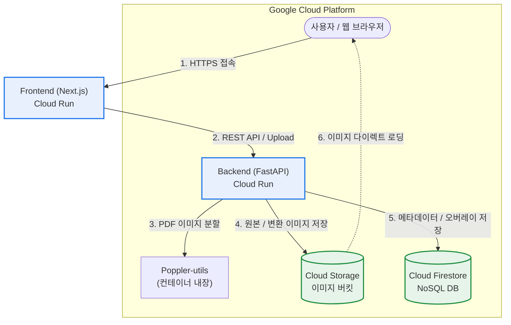

[🇺🇸 English Version](./README_EN.md)

# 📖 JJFlipBook - PDF 플립북 뷰어 서비스

PDF 문서를 업로드하여 웹 브라우저에서 실제 책을 넘기는 듯한 **3D 플립북(Page Flip)** 형태로 감상할 수 있는 어플리케이션입니다.

---

## 🏗️ 전체 아키텍처

본 프로젝트는 **Next.js 프론트엔드**와 **FastAPI 백엔드**, 그리고 **Google Cloud 인프라**를 전격 활용하여 탄생한 서버리스 기반 멀티 티어 애플리케이션입니다.

| 계층 (Layer) | 기술 스택 / 활용 |
| :--- | :--- |
| **Frontend** | `Next.js 14+`, `TailwindCSS / Vanilla CSS`, `react-pageflip` (3D 넘김) |
| **Backend** | `FastAPI (Python 3.11)`, `poppler-utils`, `pdf2image` (PDF 분할 변환) |
| **Database** | `Google Cloud Firestore` (NoSQL - 오버레이 및 메타 영구 보존) |
| **Storage** | `Google Cloud Storage` (변환된 대형 페이지 이미지 저장소 - 날짜별 폴더 구조화) |
| **Compute** | `Google Cloud Run` (서버리스 컨테이너 수직 탑재 배포) |

---

## 🏃 로컬 구동 방법

로컬 및 오프라인 환경에서 테스트 시 아래 가이드를 상호 참조하여 실행합니다.

### 1. Backend (FastAPI) 기동
```bash
# 1. 백엔드 폴더 이동 및 가상환경 설정
cd backend
python3 -m venv venv
source venv/bin/activate

# 2. 의존성 패키지 설치
pip install -r requirements.txt

# 3. 로컬 가동 (기본 8000 포트)
uvicorn main:app --reload --host 0.0.0.0 --port 8000
```
> [!NOTE]  
> 로컬에서 GCS 및 Firestore 연동을 위해서는 사용자 터미널에 `gcloud auth application-default login` 인증 토큰이 필수적입니다.

### 2. Frontend (Next.js) 기동
```bash
# 1. 프론트엔드 폴더 이동 및 패키지 설치
cd frontend
npm install

# 2. 로컬 가동 (기본 3000 포트)
npm run dev
```

---

## 🚀 Google Cloud Run 원클릭 배포 가이드

본 지면에 포함된 쉘 도구(`deploy.sh`)를 가동하면, Artifact Registry 빌드 및 Cloud Run 자동 교차 주입 배포를 5분 내로 원클릭 가동할 수 있습니다.

```bash
# 워크스페이스 마스터 디렉토리에서 실행
./deploy.sh
```

### 💡 주요 환경 변수 개요 (`deploy.sh` 가 자동 주입)
*   `NEXT_PUBLIC_BACKEND_URL`: 프론트엔드가 static 빌드 시 백엔드 앤드포인트를 바라볼 수 있도록 정적으로 구워지는 주소입니다.
*   `GOOGLE_CLOUD_PROJECT`: Cloud Storage 및 Firestore SDK 호출 시 낚아채는 프로젝트 ID 변수입니다.

> [!IMPORTANT]
> **Cloud Run 메모리 및 CPU 권장 사항**: PDF 페이지 장 수가 많거나 해상도가 높을 경우 연산 RAM 소모량이 큽니다. 백앤드의 원활한 안정적 연산을 위해 `deploy.sh` 내에 `--memory=2Gi` 및 `--no-cpu-throttling` 확충 레벨이 배정되어 있습니다. 

---

## 📂 디렉토리 구조도

```text
├── backend/
│   ├── main.py            # FastAPI 비즈니스 로직 (Firestore, GCS 연동)
│   ├── models.py          # Pydantic NoSQL 데이터 모델 팩토리
│   ├── pdf_utils.py       # poppler 기반 PDF 페이지 렌더링 디코더
│   ├── Dockerfile         # 백엔드 컨테이너 빌드 가이드 
│   └── requirements.txt   # 라이브러리 명세 파이프라인
│
├── frontend/
│   ├── src/app/           # Next.js App Router (Dashboard 및 View 페이지)
│   ├── Dockerfile         # 독립형 standalone Next.js 최적화 빌드 펙
│   └── cloudbuild.yaml    # 빌드 시점 ARG 환경변수 주입 스펙
│
└── deploy.sh              # Cloud Run 원클릭 배포 자동화 마스터 스크립트
```


---

## ☁️ Google Cloud 배포 구조도 (Architecture)


