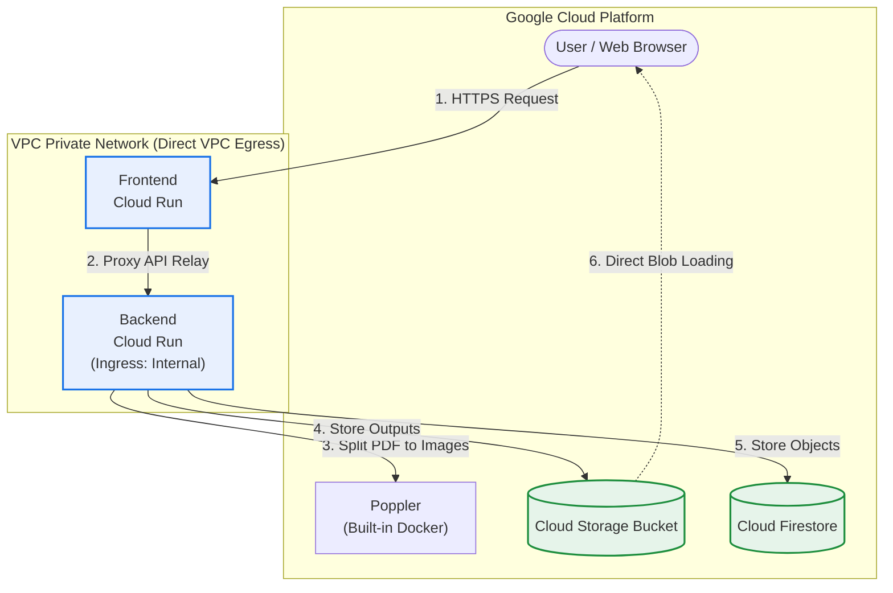

[🇰🇷 한국어 버전](./README.md)

# 📖 JJFlipBook - PDF Flipbook Viewer Service

An application to upload PDF documents and view them in a **3D Flipbook (Page Flip)** format that feels like turning a real book on a web browser. Built on Next.js frontend, FastAPI backend, and Google Cloud's serverless architecture.

---

## 🏗️ Overall Architecture

This project is a multi-layer serverless application powered massively by the Google Cloud Platform infrastructure.

| Layer | Tech Stack / Usage |
| :--- | :--- |
| **Frontend** | `Next.js 14+`, `TailwindCSS / Vanilla CSS`, `react-pageflip` (3D flip) |
| **Backend** | `FastAPI (Python 3.11)`, `poppler-utils`, `pdf2image` (PDF splitting/conversion) |
| **Database** | `Google Cloud Firestore` (NoSQL - persistent storage for overlays and meta) |
| **Storage** | `Google Cloud Storage` (Storage for converted large page images - organized by date folders) |
| **Compute** | `Google Cloud Run` (Single unified container, CPU Request-based, synchronous processing) |

> 💡 **Note:** To account for Google Cloud Storage (GCS) permission propagation time immediately after image upload, the frontend is optimized to wait approximately 5 seconds after receiving a successful upload response before loading thumbnails and data.

---

## 🏃 Local Execution Guide

Refer to the guide below to run the application securely in a local shell.

### 1. Backend (FastAPI) Startup
```bash
# 1. Move to backend folder and setup venv
cd backend
python3 -m venv venv
source venv/bin/activate

# 2. Install dependencies
pip install -r requirements.txt

# 3. Local Run (default 8000 port)
uvicorn main:app --reload --host 0.0.0.0 --port 8000
```
> [!NOTE]  
> In order to connect to GCS and Firestore locally, you must first authenticate using `gcloud auth application-default login` on your terminal.

### 2. Frontend (Next.js) Startup
```bash
# 1. Move to frontend folder and install packages
cd frontend
npm install

# 2. Local Run (default 3000 port)
npm run dev
```

---

## 🚀 Google Cloud Run One-Click Deployment

Using the shell script (`deploy.sh`) included in this project, you can build Artifact Registry images and deploy to Cloud Run securely.

```bash
# Run from the workspace root directory
./deploy.sh
```

### 💡 Key Environment Variables
*   `NEXT_PUBLIC_BACKEND_URL`: Injected during static build to point the frontend to the backend endpoint natively without CORS delays.
*   `GOOGLE_CLOUD_PROJECT`: Used by Cloud Storage and Firestore SDKs to identify the GCP project origins.

> [!IMPORTANT]
> **Cloud Run Memory & Timeout Allocation**: PDF conversion may consume large RAM workloads and take several minutes. To maintain robust availability without connection drops or OOM restarts, `--memory=2Gi` and `--timeout=600` configurations are included securely inside `deploy.sh`! (Request-based CPU allocation is now used to minimize idle costs).

---

## 📂 Directory Structure

```text
├── backend/
│   ├── main.py            # FastAPI business logic (Firestore, GCS integration)
│   ├── models.py          # Pydantic NoSQL data models
│   ├── pdf_utils.py       # poppler-based PDF rendering decoder
│   ├── Dockerfile         # Backend container blueprint
│   └── requirements.txt   # Dependency specifications
│
├── frontend/
│   ├── src/app/           # Next.js App Router (Dashboard & View pages)
│   ├── Dockerfile         # Standalone Next.js optimized build blueprint
│   └── cloudbuild.yaml    # Build-time ARG injection specs
│
└── deploy.sh              # One-click Cloud Run deploy automation script
```

## 🚀 OOM Prevention & Asynchronous Performance

Designed to intercept server crashes and out-of-memory cascades during enormous PDF processing procedures.

### 1. Chunked PDF Processing
*   **Memory Spike Mitigation**: Prevents RAM spikes by parsing large PDFs sequentially in smart **5-Page Chunks** rather than dumping the whole blob.
*   **Multiprocessing**: Spawns multiple physical decoding cores utilizing `thread_count=4` inside `pdf2image` arrays.

### 2. End-to-End Streaming Transports
*   **Frontend-Proxy Relay**: Streaming API intercepts utilizing `duplex: 'half'` policies, entirely removing buffering overlaps inside the Node layer.
*   **Backend Streaming Sink**: Writing chunks via `shutil.copyfileobj` pipelines bypasses RAM allocations gracefully.
*   **Concurrent Upload Pools**: Leveraged `ThreadPoolExecutor` bindings to upload parallel arrays (up to 5 workers) directly towards the unified GCS storage bucket seamlessly.

### 3. 📂 1-Level Folder Structure & Cascade Archiving
*   **Virtual Prefix Nesting**: Implemented a standalone 1-depth metadata parsing routine mapped via `folder_id` matching states.
*   **Data Decoupling Principle**: The underlying Storage blob URLs persist securely isolated from UI layer definitions allowing seamless cross-structural `Moves` internally without actual expensive Object Copy operations!
*   **Heavy Cascade Cleanup**: Administrative purges of Folders programmatically execute hard-deletions on child `Overlays`, child `Firestore Maps`, and finally sweeping away remaining static GCS buckets systematically.

### 4. Cleanup Guarantee
*   **Forced Garbage Cleanups**: `finally` blocks explicitly mandate terminal OS-level directory wiping (`shutil.rmtree`), strictly closing out dangling memory leaks.

### 5. Media & Original Asset Retention (Audio & Original PDF)
*   **Permanent PDF Storage**: Alongside the chunked images, the pristine `.pdf` file is directly teleported to the GCS bucket during upload. This ensures the original quality document remains eternally retrievable.
*   **Intuitive Download UI (Viewer)**: An automated Download Button orchestrates itself into the bottom-bar controls inside the Viewer, providing direct raw-download flows to viewers seamlessly.
*   **Audio Autoplay Unlocker**: Bypassing heavy mobile browser (Safari/iOS) Autoplay Policies, Background `.mp3` music pipelines attach to 'First Interaction Listeners' (`pointerdown`, `touchstart`) across the document, ensuring multimedia streams unlock reliably upon the very first viewer intent.

---

## 🔒 Restricted Internal Routing (Direct VPC Egress)

### 1. Closed Network Topology
Infrastructures are heavily isolated through stringent Virtual Private network boundaries (`jwlee-vpc-001`) preventing direct public access.
*   **Internal Ingress**: The Backend API relies on `--ingress=internal` policies to completely shut off payload deliveries originating from the open Internet.
*   **Proxy Relay**: No remote browser accesses the backend directly; Front-facing Next.js applications strictly proxy the endpoints acting as secure middlemen (`/api/backend/*`).
*   **Direct VPC Egress**: Configured symmetrically with `--vpc-egress=all-traffic`, constraining all outbounds within local subnets seamlessly.

### 2. Serverless Private DNS Routing
*   Routing for the Google Cloud service domains (`.run.app`) is autonomously overridden via a dedicated **Private DNS Zone** inside the VPC perimeter.
*   This ensures all Cloud Run-to-Cloud Run traffic inherently targets Google's interior API layers (`199.36.153.8`) ensuring rapid latency acceleration uncompromised by external NAT IPs.

### 3. Persistent API Gateway Guards
*   State-mutating REST channels natively check for administrative permissions. Deletions and updates strictly traverse persistent `verify_api_key` authentication middlewares effectively evaluating payloads.

---

## 🔑 Administrator Authentication & Security Refactoring

A highly modernized login architecture redesigned strictly for Zero-Trust principles and exclusive session control.
*   **Zero-Trust Password Elimination**: Eradicated the vulnerable legacy frontend routine (`loginId === admin`) inside the `AuthGuard` container, which dangerously evaluated passwords statically on the client side. All validations are now safely proxied (`POST /api/backend/login`) to the isolated backend.
*   **Randomized Admin Seeding**: Patched the flawed auto-seeding logic which previously defaulted to the static `admin` footprint. The `deploy.sh` script now implements cryptographic (`openssl rand -base64`) password generation at the initial lifespan hook.
*   **Bcrypt Encryption Overhaul**: Upgraded the algorithm by completely stripping legacy `passlib` exceptions and replacing them manually executing intrinsic `bcrypt` validations securing hash collisions securely.
*   **React State Parity**: Client-side hook instances now synchronize with unified global generic loops bypassing overlapping component bugs reliably.

---

## 🛠️ Client React Hydration Fixes (Stability)

*   **SSR Crash Prevention**: Removed raw DOM invocations scaling global animations. Repositioned elements securely inside nested `useEffect` sandboxes dropping `This page couldn't load` crashes.
*   **React Error #310 Hooks Enforcement**: Rearranged Early Return conditional architectures completely ensuring robust React DOM component lifecycle states. Fixed unexpected unmount/mount Hooks sequential disruptions.
*   **Next.js API Static Data Cache Sabotage**: Eradicated an aggressive Next.js App Router anomaly where default `GET` fetches statically cached empty placeholder data permanently upon production builds. By injecting `export const dynamic = 'force-dynamic'` and `cache: 'no-store'`, zero-downtime live-fetching bridges the Next.js API Proxy with FastAPI correctly.
*   **Mobile-Responsive Dashboard Arrays**: Optimized CSS Flex properties to sequentially stack heavy UI elements natively inside narrow viewports, preventing destructive UI overlapping anomalies across smartphones.
*   **Dynamic Viewer Scaling & Viewport Re-anchoring (100dvh)**: Solved a critical overlap issue where the flipbook component aggressively scaled out of bounds and forcefully clipped the bottom audio/pager control bars on mobile endpoints. Integrated `100dvh` (Dynamic Viewport Height) alongside an intuitive top-down flex scaling algorithm (`center top` scaling deductions), ensuring the document natively anchors itself rendering harmonious bottom controls flawlessly without manual scrolling.

---

## ☁️ Google Cloud Architecture Diagram (Mermaid)



---

## 🧪 Shift-Left TDD & Automated CI/CD Pipeline

To prevent critical deployment failures and reduce Google Cloud infrastructure costs, `deploy.sh` natively implements a **Shift-Left TDD** bi-directional pipeline integration.

### 1. Pre-Flight Checks (Offline Defense Phase)
*   **Backend Validation (Pytest TestClient)**: In-memory simulation directly invokes endpoints like `login` and `upload` mimicking native routers. Immediate pipeline failure (`exit 1`) happens bypassing HTTP overheads if any syntactic or schema logic fails.
*   **Frontend Static Compiler Guard**: Runs `npm run build` locally inside the `frontend` container before initiating any massive Playwright contexts or Docker caching layers, effectively shielding the cloud rollout from rendering crashes. 
*   **Hardcoded Credentials Security**: Eliminates string literals that trigger automated Static Application Security Testing (e.g. CodeQL warnings) by injecting obfuscated **Base64** decoded streams into internal password variables and testing configurations.

### 2. Post-Flight Validations (E2E Integration)
*   **Playwright E2E**: Leverages a headless `chromium` browser runtime targeted at the exact deployed Cloud Run STAGING endpoints to autonomously simulate user flows—verifying everything from secure dashboard login and bypassing fake `sample_test.pdf` components, to catching dynamic API `200 OK` alert traces.
*   **Database Isolation Policy**: All artifacts dropped during the continuous testing lifecycle are prefixed with `E2E_TEST_`, facilitating reliable query dumps without polluting core enterprise datasets.
