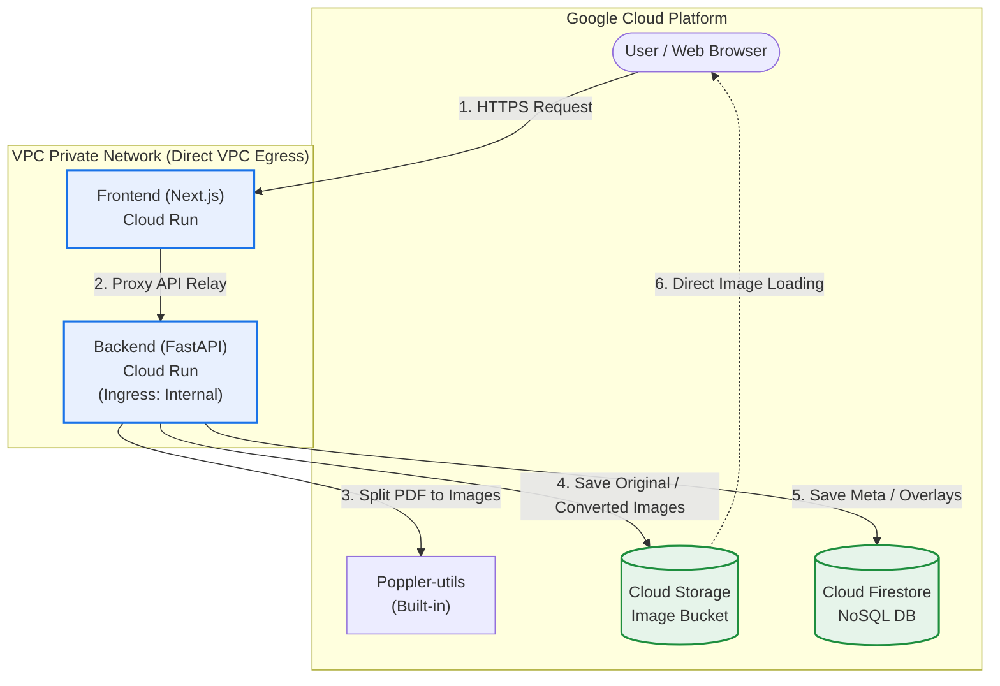

[🇰🇷 한국어 버전](./README.md)

# 📖 JJFlipBook - PDF Flipbook Viewer Service

An application to upload PDF documents and view them in a **3D Flipbook (Page Flip)** format that feels like turning a real book on a web browser.

---

## 🏗️ Architecture

This project is a serverless multi-tier application built using **Next.js frontend**, **FastAPI backend**, and **Google Cloud infrastructure**.

| Layer | Tech Stack / Usage |
| :--- | :--- |
| **Frontend** | `Next.js 14+`, `TailwindCSS / Vanilla CSS`, `react-pageflip` (3D flip) |
| **Backend** | `FastAPI (Python 3.11)`, `poppler-utils`, `pdf2image` (PDF splitting/conversion) |
| **Database** | `Google Cloud Firestore` (NoSQL - persistent storage for overlays and meta) |
| **Storage** | `Google Cloud Storage` (Storage for converted large page images - organized by date folders) |
| **Compute** | `Google Cloud Run` (Serverless container deployment) |

---

## 🏃 Local Execution Guide

Refer to the guide below to run the application in a local or offline environment.

### 1. Backend (FastAPI) Startup
```bash
# 1. Move to backend folder and setup venv
cd backend
python3 -m venv venv
source venv/bin/activate

# 2. Install dependencies
pip install -r requirements.txt

# 3. Local Run (default 8000 port)
uvicorn main:app --reload --host 0.0.0.0 --port 8000
```
> [!NOTE]  
> In order to connect to GCS and Firestore locally, you must first authenticate using `gcloud auth application-default login` on your terminal.

### 2. Frontend (Next.js) Startup
```bash
# 1. Move to frontend folder and install packages
cd frontend
npm install

# 2. Local Run (default 3000 port)
npm run dev
```

---

## 🚀 Google Cloud Run One-Click Deployment

Using the shell script (`deploy.sh`) included in this project, you can build Artifact Registry images and deploy to Cloud Run with automatic chaining.

```bash
# Run from the workspace root directory
./deploy.sh
```

### 💡 Key Environment Variables (Auto-injected by `deploy.sh`)
*   `NEXT_PUBLIC_BACKEND_URL`: Injected during static build to point the frontend to the backend endpoint.
*   `GOOGLE_CLOUD_PROJECT`: Used by Cloud Storage and Firestore SDKs to identify the GCP project.

> [!IMPORTANT]
> **Cloud Run Memory & CPU Allocation**: PDF conversion may consume large RAM workloads if page numbers are high. To maintain robust availability without OOM restarts or CPU freezing, `--memory=2Gi` and `--no-cpu-throttling` configurations are included by default inside `deploy.sh` node setup!

---

## 📂 Directory Structure

```text
├── backend/
│   ├── main.py            # FastAPI business logic (Firestore, GCS integration)
│   ├── models.py          # Pydantic NoSQL data models
│   ├── pdf_utils.py       # poppler-based PDF rendering decoder
│   ├── Dockerfile         # Backend container blueprint
│   └── requirements.txt   # Dependency specifications
│
├── frontend/
│   ├── src/app/           # Next.js App Router (Dashboard & View pages)
│   ├── Dockerfile         # Standalone Next.js optimized build blueprint
│   └── cloudbuild.yaml    # Build-time ARG injection specs
│
└── deploy.sh              # One-click Cloud Run deploy automation script
```

---

## ☁️ Google Cloud Architecture Diagram



---

## 🔒 Direct VPC Internal Call & Responsive UI Upgrades

With recent patches, **security-hardened internal routing** and **mobile screen fitting** are fully integrated.

### 1. Mobile Responsive UI Fix
*   **Dashboard**: Sidebar breaks into a **top horizontal menu bar** dynamically for vertical responsive stacking.
*   **Flipbook Viewer**: **Hides the sidebar completely (`display: none`)** to consume maximizing reading screen widths, recalculating scale dimensions effectively.

### 2. Direct VPC Egress & Next.js API Routes Proxy
Locks outbound connections securely inside closed boundaries network.
*   **Proxy Relay**: Requests do not trigger straight into Absolute URLs; `FE Server (Node.js)` triggers Proxy forward nodes. (`/api/backend/*`)
*   **Internal Ingress**: `Backend Cloud Run` is launched with `--ingress=internal`, completely shutting off external internet pokes.
*   **Direct VPC Egress**: Frontend communicates private channels with `--vpc-egress=all-traffic` parameters targeting only internal backbone layouts.
```
